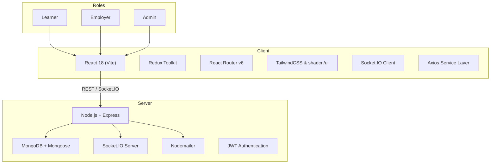
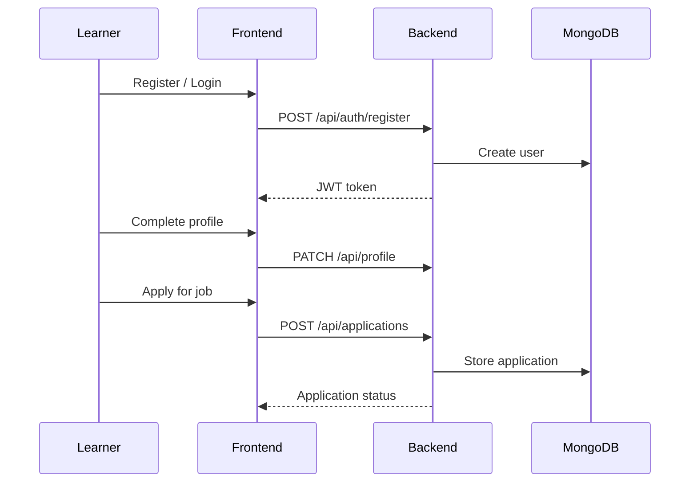

# SADHN: Skills and Development Hub Network

> **Empowering Skill India: A full-stack platform for skill enhancement, job discovery, and professional growth.**

---

## 🏗️ Project Overview

SADHN is a modern, scalable full-stack web application designed to connect **learners**, **employers**, and **administrators** on a single platform. It enables job seekers to upskill and discover opportunities, while helping employers identify and hire the right talent. The system supports real-time notifications, analytics dashboards, and a robust admin panel.

---

## 🖼️ System Architecture



---

## ✨ Features

### 👨‍🎓 Learner

- User registration, authentication, and profile management
- Browse and apply for jobs
- Track job application status
- Discover and enroll in skill-development programs
- Personalized dashboard and recommendations
- Real-time notifications and platform updates

### 🏢 Employer

- Create and manage job postings
- Review and manage job applications
- Publish articles for employer branding
- Access analytics and hiring insights
- Company profile management

### 🛡️ Admin

- Platform-wide analytics and statistics
- Manage users, jobs, news, and skill programs
- Moderate content and handle contact submissions
- Respond to user inquiries

---

## 🛠️ Technology Stack

### Frontend

- React 18 (Vite)
- Redux Toolkit
- React Router v6
- TailwindCSS, shadcn/ui, Lucide Icons
- Axios
- React Hook Form + Zod
- Socket.IO Client
- Sonner (toast notifications)

### Backend

- Node.js
- Express
- MongoDB
- Mongoose
- JWT Authentication
- bcrypt
- express-validator
- Nodemailer
- Socket.IO
- Jest & Supertest (175+ automated tests)

---

## 📁 Project Structure

```text
sadhn/
├── client/
│   └── src/
│       ├── components/
│       ├── pages/
│       ├── layouts/
│       ├── lib/
│       ├── store/
│       ├── context/
│       └── routes/
├── server/
│   ├── controllers/
│   ├── models/
│   ├── routes/
│   ├── config/
│   ├── middlewares/
│   ├── utils/
│   └── tests/
└── README.md
```

---

## 🔌 API & State Management

- **RESTful APIs** exposed under `/api/*`
- **Service Layer Pattern** used on the frontend for API abstraction
- **Redux Toolkit** for managing authentication, profiles, jobs, and UI state
- **Socket.IO** for real-time notifications and news updates
- **Role-based Access Control (RBAC)** for Learner, Employer, and Admin

---

## 🚀 Getting Started

### Prerequisites

- Node.js `>= 18`
- MongoDB `>= 4.4`

### Installation & Setup

```bash
# Clone the repository
git clone <repository-url>
cd sadhn

# Install backend dependencies
cd server
npm install

# Install frontend dependencies
cd ../client
npm install
```

### Environment Variables

Create `.env` files for both client and server. Refer to:

- [`server/README.md`](server/README.md) for backend environment variables
- [`client/README.md`](client/README.md) for frontend environment variables

### Run the Application

```bash
# Start backend server
cd server
npm run dev

# Start frontend development server
cd ../client
npm run dev
```

---

## 🚀 Deployment

The application is deployed and accessible at:

- **Frontend**: [https://sadhn-in.vercel.app](https://sadhn-in.vercel.app)
- **Backend API**: [https://sadhn-in.onrender.com](https://sadhn-in.onrender.com)
- **GitHub Repository**: [https://github.com/igmansvi/sadhn](https://github.com/igmansvi/sadhn)

---

## 🧪 Testing

- **Backend Testing:**

  ```bash
  npm test
  ```

  - 175+ automated tests using Jest and Supertest

- **Frontend Testing:** Manual testing across all user flows

---

## 📊 Example User Flow



---

## 📚 Documentation

- Frontend: [`client/README.md`](client/README.md)
- Backend: [`server/README.md`](server/README.md)
- API Reference: [`server/README.md#api-endpoints`](server/README.md#api-endpoints)

---

## 🤝 Contributing Guidelines

1. Follow the established code style and folder structure
2. Add appropriate validation, error handling, and tests
3. Ensure accessibility and responsive design
4. Document any new features or breaking changes

---

## 🏆 Project Status

- ✅ Feature-complete with core functionality implemented
- 🛡️ Secure authentication and authorization
- 📈 Scalable, modular, and real-time ready

---

## © 2025 SADHN — Skill India Initiative
